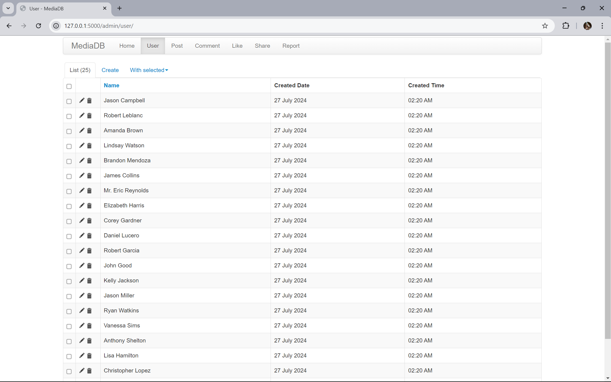

  

## Project Description

The Flask-based application efficiently manages users, posts, comments, likes, shares, and reports in a social media context. It features a robust administrative interface for seamless data management and secure user authentication.

### Key Features

- **User Authentication**: Secure login and registration using password hashing.
- **Admin Interface**: Protected admin dashboard via [Flask-Admin](https://github.com/areebahmeddd/MediaDB/blob/main/app/admin_views.py) for comprehensive management of users, posts, comments, likes, shares, and reports.
- **Relational Data Management**: [SQLAlchemy ORM](https://github.com/areebahmeddd/MediaDB/blob/main/app/models.py) to define and manage relationships between users and their posts, comments, likes, shares, and reports, ensuring referential integrity and cascading actions.
- **Session Management**: Session-based authentication to safeguard access to administrative functions.
- **Database Initialization**: Automatic setup of the [SQLite database](https://github.com/areebahmeddd/MediaDB/blob/main/config.py) schema and creation of an initial admin user for immediate deployment and use.

Developed for the subject: Database Management Systems (22CB43)

## Project Preview

  
   
  Sign In Page

---

  
   
  Sign Up Page

---

  
   
  Home Page

---

  
   
  User Page

---

  
   
  Post Page

---

  
   
  Comment Page

---

  
   
  Like Page

---

  
   
  Share Page

---

  
   
  Report Page

